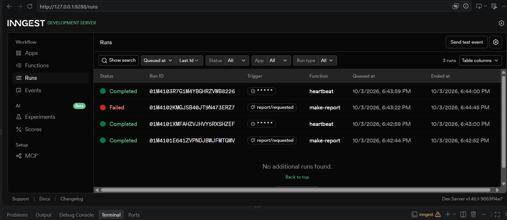

# Background Job Assignment 9

FlyRank Internship — Backend Track — Week 8 — Your First Background Job

## What this is
A small API where slow work (an 8-second "report generation") happens in a background
job via Inngest, instead of inside the request. The endpoint answers instantly; a
separate status endpoint reports progress. A cron job runs independently on a schedule.

## How to run

Terminal 1 — the API:
\`\`\`bash
npm install
INNGEST_DEV=1 node index.js
\`\`\`

Terminal 2 — the Inngest Dev Server:
\`\`\`bash
npx inngest-cli@latest dev -u http://127.0.0.1:3000/api/inngest
\`\`\`

Dashboard: http://127.0.0.1:8288

## Endpoints & functions

| Endpoint | What it does |
|---|---|
| `GET /health` | health check |
| `POST /reports` | accepts `{ "topic": "..." }`, returns `202` + `{ id, status: "pending" }` instantly |
| `GET /reports/:id` | returns the report's current status: `pending`, `done`, or `failed`; `404` if unknown |

| Function | Trigger | What it does |
|---|---|---|
| `say-hello` | event `test/hello` | test function, sleeps 5s |
| `make-report` | event `report/requested` | sleeps 8s, then builds the report; retries twice on failure |
| `heartbeat` | cron `* * * * *` | logs counts of pending/done/failed reports, every minute |

## Proof: 202 then poll

\`\`\`bash
curl -i -X POST http://127.0.0.1:3000/reports -H "Content-Type: application/json" -d '{"topic":"cats"}'
# → 202 { "id": "5", "status": "pending" }  (responds in well under 1 second)

curl -i http://127.0.0.1:3000/reports/5
# immediately after: { "status": "pending" }
# ~10s later:        { "status": "done", "result": "Report on \"cats\" generated at ..." }
\`\`\`

## Stage 3 note
A **retry** is for a wrong *moment* — a temporary failure that might succeed if tried
again (network blip, service hiccup). A **400** is for wrong *input* — a missing `topic`
will never succeed no matter how many times it's retried, so it's rejected immediately
with no job ever created.

## Stage 4 notes
- Every day at 08:00 → `0 8 * * *`
- Every Sunday at 22:00 → `0 22 * * 0`

## Dashboard screenshot
